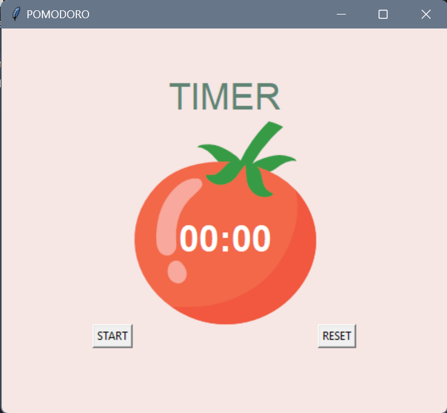

# pomodoro-app
A simple Pomodoro timer application built with Python and the tkinter library.


## Overview

This Pomodoro timer application helps you manage your work and break intervals effectively. It follows the Pomodoro technique, allowing you to work for a set time, take short breaks, and a longer break after a series of work intervals. The timer keeps you on track, and you can easily start and reset it as needed.


## Features

- Simple and intuitive user interface.
- Customizable work and break intervals.
- Visual cues with color changes and checkmarks.
- Start, stop, and reset functionality.
- Supports the Pomodoro technique for time management.


## Usage

1. Clone the repository to your local machine:

   ```bash
   git clone https://github.com/your-username/pomodoro-timer.git
   cd pomodoro-timer
   ```

2. Run the Pomodoro timer application:

   ```bash
   python pomodoro.py
   ```

3. Click the "START" button to begin a work interval.
4. During work intervals, the timer will count down.
5. After each work interval, you'll get a break.
6. A longer break is given after completing a set of work intervals.
7. Use the "RESET" button to stop the timer and reset it.

## Getting Started

To run this project, you need Python and the tkinter library installed on your computer. If you don't have them, you can download and install Python from the [official website](https://www.python.org/downloads/).

## Screenshots




